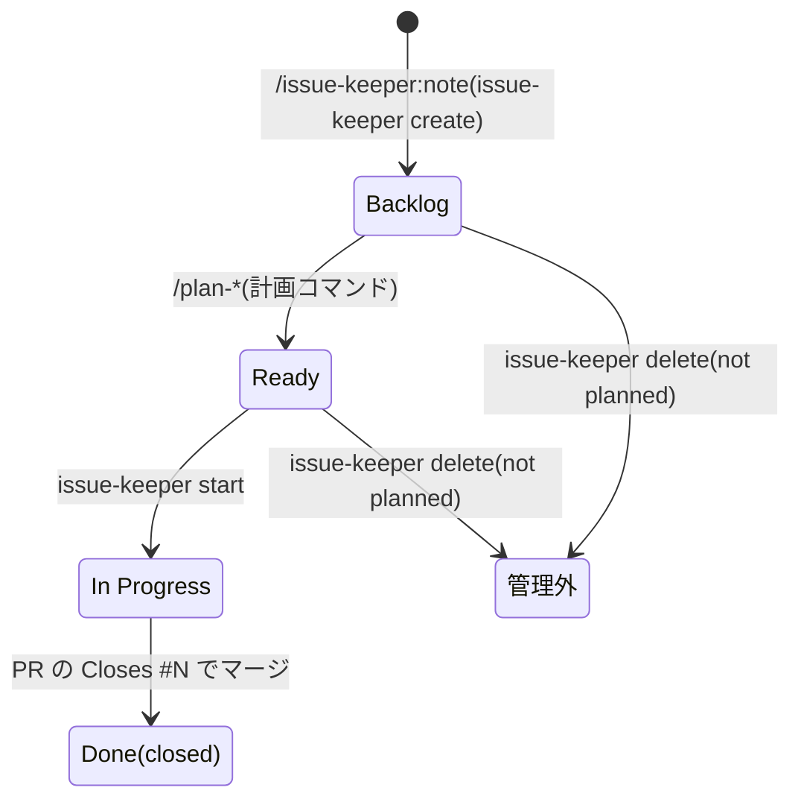

# ワークフロー

設計の核は「**スキルは会話と文章生成だけを担い、状態の真実と遷移の判断は CLI が持つ**」という分離である。AI セッションが長くなっても、`issue-keeper inspect --dispatch` が返す指示に従う限りワークフローから逸脱できない。

実行形はリポジトリルートで `pnpm -s issue-keeper <command>`。すべてのコマンドは stdout に JSON(複数件は JSONL)を出す。

## 状態遷移

Container(子持ち)の Status は子からのロールアップで決まり、直接遷移させない(Backlog → Ready の昇格だけは計画コマンドの専権。`docs/model.md` の計画ゲートを参照)。

## ディスパッチャ(`inspect --dispatch`)

issue の workUnit と Status から「次の 1 手」を決定して返す。`instruction` はそれ単体で実行可能な日本語 1〜2 文で、コマンドまたはスキル名と issue 番号を必ず含む。

| 状態 | action | 次の 1 手 |
|---|---|---|
| Note(Backlog) | `plan-<kind>` | Kind ごとの計画スキル(`/issue-keeper:plan-feature`=要件定義 / `/issue-keeper:plan-bug`=原因調査 / `/issue-keeper:plan-adr`=ADR 作成 / `/issue-keeper:plan-epic`=スコープ整理) |
| Task(Ready) | `start-task` | `issue-keeper start N` |
| Task(In Progress) | `task-in-progress` | `/implement` で実装を進め、PR の `Closes #N` で閉じる(終端) |
| Task / Container(Done) | `done` | 完了。追加作業は新しい issue へ(終端) |
| Container・Ready の子がちょうど 1 件 | `next-step-sub-issue` | `/issue-keeper:next-step #子` |
| Container・Ready の子が複数 | `next-step-sub-issue` | どれを進めるか人に確認して `/issue-keeper:next-step` を再実行 |
| Container・Ready の子が 0 件 | `error-state` | Backlog の子は `/issue-keeper:next-step #子`、In Progress の子は作業続行 |
| Malformed | `error-state` | 欠陥の列挙と `issue-keeper set-fields` の具体例 |

## スキル構成

| スキル | 役割 |
|---|---|
| `/issue-keeper:note` | 起票の唯一の入口。メタデータ推定 → (bug は intake 聞き切り)→ 重複チェック → `create` → 報告 |
| `/issue-keeper:next-step` | 前進の唯一の入口。`inspect --dispatch` の instruction にそのまま従う |
| `/issue-keeper:plan-feature` | 要件・受け入れ条件・SP を書いて Ready へ |
| `/issue-keeper:plan-bug` | 根本原因を調査し 原因調査・SP を書いて Ready へ |
| `/issue-keeper:plan-adr` | 決定(+検討した選択肢)・SP を書いて Ready へ(tooling / refactor) |
| `/issue-keeper:plan-epic` | feature の子を起票し スコープ を書いて Ready へ |
| `/implement` | Ready / In Progress の Task を実装し、`Closes #N` 付き PR まで運ぶ |

## コマンド一覧

| コマンド | 役割 |
|---|---|
| `create <file...>`(JSON オブジェクト / 配列 / JSONL。`-` で stdin) | 起票。トップレベル行は intake フィールド必須、子行(`parent`)は `description` / `sp`。インライン JSON をシェルに書かずファイルで渡す |
| `inspect <n> [--dispatch] [--validate]` | issue に関するすべてを 1 コマンドで読む |
| `list [--kind K] [--status S]` | open な管理対象 issue の列挙(重複チェック用) |
| `plan-feature / plan-bug / plan-adr / plan-epic` | Backlog → Ready 遷移(Memory を同じ保存で吸収) |
| `update <kind> <n> --<セクション> ...` | 管理セクションの正規の修正手段(preserve-on-omit) |
| `start <n>` | Ready の Task を In Progress へ + @me アサイン |
| `set-fields <n>` | フィールド・タイトルの直接矯正(復旧用) |
| `delete <n>` | closed as not planned + 親から detach(冪等)。素の `gh issue close` は使わない |

## 終了コード

| Code | 意味 |
|---|---|
| 0 | 成功 |
| 1 | ネットワーク・GitHub・認証の失敗 |
| 2 | 使い方の誤り、または dispatch の error-state |
| 3 | `inspect --validate` の不変条件違反(計画ガードの拒否を含む) |
| 4 | 事後条件違反。最終行に `{"error":"post-condition-failed","expected":...,"actual":...}`。復旧は `set-fields` |

フィールド書換と本文書換は GitHub API 上アトミックにできない。各遷移コマンドは本文 → フィールドの順に書き、書込後に再分類して約束と照合し、不一致なら exit 4 とする。
